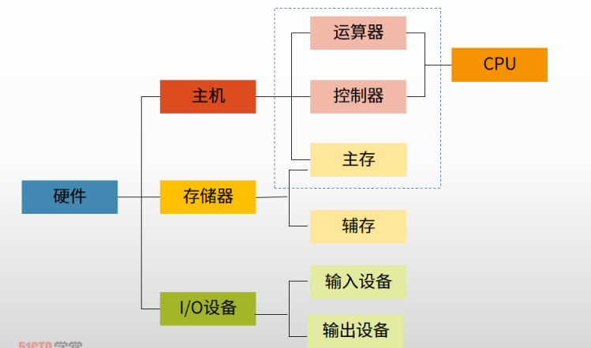
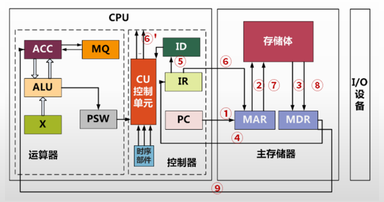
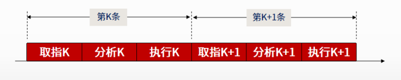
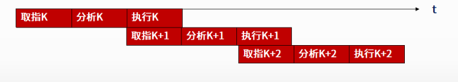
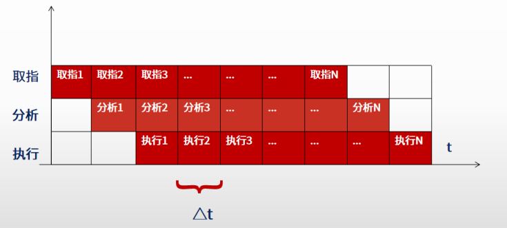
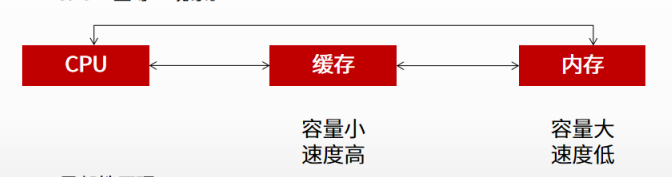

# 计算机体系结构

# 一、计算机硬件组成

## 主机

- 运算器
- 控制器
- 主存

### CPU

> 运算器与控制器为CPU的主要组成部分

#### 指令

指令执行步骤：

1. 取指
   1. PC -> AI -> M -> DR -> IR
2. 分析
   1. OP -> ID -> CU
3. 执行
   1. AD -> AR -> M -> DR -> AC

#### 运算器

组成：

- ==算数逻辑单元ALU==：数据的算术运算和逻辑运算
- ==累加寄存器AC==：通用寄存器，为ALU提供一个工作区，用来暂存数据
- 数据缓冲寄存器DR：写内存时，暂存指令或数据
- 状态条件寄存器PSW：存状态标志或控制标志

#### 控制器

- ==程序计数器PC==：存储下一条要执行的指令的地址
- 指令库寄存器IR：存储即将执行的指令
- 指令译码器ID：对指令中的操作码字段进行分析解释
- 地址寄存器AR：用来保存当前CPU所访问的内存单元地址
- 时序部件：提供时序控制信号

## 储存器

- 主存
- 辅存

## I/O设备

- 输入设备
- 输出设备

# 二、指令系统

> 指令系统是计算机硬件的语言系统，是机器所具有的全部指令的集合，反映了计算机所拥有的基本功能

- 操作码字段OP: 指令的功能
- 操作数地址码字段Addr: 指令的操作对象

## 复杂指令系统

复杂指令系统CISC的基本思想是进一步增强原有指令的功能，用更为复杂的新指令取代原先由软件子程序完成的功能，实现软件功能的硬化，导致机器的指令系统越来越庞大，复杂。目前使用的绝大多数计算机都输入CISC类型

### CISC特点

- 指令数量众多。指令系统拥有大量的指令，通常有100~250条
- 指令使用频率相差悬殊，最常使用的是一些比较简单的指令，仅占指令总数的20%，但在程序中出现的频率却占8-%，而大部分复杂指令却很少使用
- 支持多种寻址方式，5~20种
- 变长的指令，长度不固定
- 指令可以对主存单元的数据直接进行处理，执行速度慢
- 以微程序控制为主，CISC指令系统很复杂，难以用硬布线逻辑电路实现控制器，通常采用微程序控制

## 精简指令系统

精简指令系统RISC的基本思想就是通过减少指令总数和简化指令功能来降低硬件设计的复杂度，使指令能单周期执行，并通过优化编译、提高指令的执行速度，采用硬布线控制逻辑优化编译程序

### RISC的特点

- 指令数量少，优先选取使用频率最高的一些简单指令和一些常用指令，避免使用复杂指令
- 指令的寻址方式少
- 指令长度固定，指令格式种类少
- 以硬布线逻辑控制为主，为了提高操作的执行速度，通常采用硬布线逻辑(组合逻辑)来构建控制器
- 单周期指令执行，采用流水线技术。因为简化了指令系统，很容易利用流水线技术，使得大部分指令都能在一个机器周期内完成
- 优化的编译器，RISC的精简指令集使编译工作简单化，因为指令长度固定，格式少，寻址方式少，编译时不必在具有相似功能的许多指令中进行选择，也不必为寻址方式的选择而费心，同时易于实现优化，从而可以生成高效率执行的机器代码
- CPU中的通用寄存器数量多，一般在32个以上，有的可达上千个

## 指令的流水

指令流水技术：指令步骤的并行、提高处理器执行指令的效率，假设使用流水线将指令流的处理过程划分为取指、分析、执行三个并行处理的过程段，在这个流水线中，处理器有三个操作部件，同时对这三条指令进行加工，加快了程序的执行速度，几乎所有的高性能计算机都采用了指令流水线

### 指令执行方式

- **顺序方式**：各条机器指令之间顺序串行的执行，执行完一条指令后取下一条指令，缺点是速度慢，机器各个部件利用率低
- **重叠方式**：在解释第K条指令的操作完成之前就可以开始解释第K+1条指令

- **流水方式**
  - 流水线周期：执行时间最长的一段
  - 流水线执行时间：(t1+t2+t3)+(n-1)△t
  - 流水线的吞吐率和最大吞吐率：吞吐率是指单位内流水线处理机流出的结果数，对于指令来说，就是单位时间内执行的指令数 = 指令条数 / 流水线执行时间
  - 流水加速比：不适用流水线的执行时间 / 使用流水线的执行时间

# 三、存储系统

主要分为：

- 寄存器
- Cache
- 主存
- 磁盘

从上到下容量从小到大、速到从快到慢、价格从高到低

## 高速缓冲存储器Cache

Cache是一种相联存储器，解决CPU和主存之间的速度差异，避免CPU"空等"现象

由于缓存比内存小，不可能将所有数据都放缓存，只能将经常使用的数据放缓存，用以下两种局部性原理来判断哪些数据放缓存：

- 时间局部性
- 空间局部性
