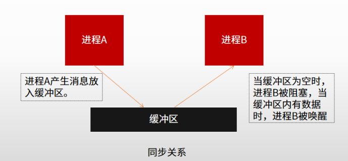

# 操作系统

## 一、进程管理

### 1.1 基本概念

**进程**通常是由程序、数据集合、进程控制块PCB组成。PCB是一种数据结构，是进程存在的唯一标识

- 线性方式：将所有PCB组织在一张线性表中，每次查找需要扫描全表
- 链接方式：把具有同一状态的PCB，用其中的链接字(如图中PCB后面的数字)链接在一个队列，PCB储存在一个连续的区域
- 索引方式：同一状态的进程归入一个索引表，多个状态对应多个不同的索引表。

**进程的三种状态**

- 运行态：在处理机上运行时
- 就绪态：获得了除处理机以外的一切资源，一旦得到处理机就能运行
- 阻塞态：正在等某一事件的发生而暂时停止运行，此时即时把处理机给它也无法运行

### 1.2 前驱图

前趋图是一个有向无循环图，由节点和有向边组成，节点代表各程序段的操作，而节点间的有向边表示两个程序段操作之间存在的前趋关系。用于这种图可以描述多个程序或进程之间的执行顺序关系。

如图,P1结束之后P2才能开始，每根箭线代表一个前驱关系

### 1.3 进程的通信

#### 1.3.1 进程的互斥

进程的互斥是指系统中多个进程因争用临界资源而互斥执行。临界资源是指一次只能供一个进程使用的资源，如打印机。

#### 1.3.2 进程的同步

在系统中有一些进程是需要互相合作，协同工作的。这样的进程之间的联系就叫同步。例如生产者和消费者的关系

#### 1.3.3 PV操作

- P操作(相当于拿到资源进入队列执行)：
  - ①将信号量S的值减1，即S=S-1;
  - ②如果S>=0,则该进程继续执行；否则该进程置为等待状态。
  - 前趋图中，进程通过P操作判断是否被阻塞

- V操作(相当于释放资源至资源池)：
  - ①将信号量S的值加1，即S=S+1;
  - ②如果S>0该进程继续执行；否则说明有等待队列中有等待进程，
    需要唤醒等待进程。
  - 前趋图中，进程通过V操作唤醒后续进程执行

> 信号量S的物理意义：S≥0表示某资源的可用数(是有初始值的喔)，若S<0,则其绝对值表示阻塞队列中等待该资源的进程数。
>
> P&V，是荷兰语的缩写表达，不是英文的

#### 1.3.4 死锁

两个以上进程互相都要求对方已经占有的资源、导致无法继续运行下去的现象

产生死锁的必要条件：

-  互斥条件
- 请求保持条件
- 不可剥夺条件
- 环路的等待

## 二、存储管理

### 2.1 基本概念

#### 2.1.1 地址重定位

地址重定位是指将程序中的地址虚拟地址（逻辑地址）变换成内存的真实地址（物理地址）的过程。

- 逻辑地址：相对地址。用户目标程序所使用的地址单元，一般以0作为基址。
- 物理地址：绝对地址。加载到内存地址寄存器中的地址，内存单元的真正地址。

### 2.2 存储管理方案

存储管理的主要目的是解决多个用户使用主存的问题

#### 2.2.1 分区管理

把主存的用户区划分成若干个，每个区域分配给一个用户作业使用，并限定他们只能在自己的区域中运行

- 该方案容易造成存储空间浪费
- 可能有些资源无法完整放置在某个区中

#### 2.2.2 分页管理

将一个进程的地址空间划分成若干个大小相等的区域，称为**页**。相应地，将主存空间划分成与页相同大小的若干个物理块，称为**块或页框**。

- 没有考虑用户程序大小，无论大小多少，页都是一样大

#### 2.2.3 段页式管理

分段式存储管理系统中，为每个段分配一个连续的分区，而进程中的各个段可以离散地分配到主存的不同分区中。在系统中为每个进程建立一张段映射表，简称为“**段表**”。每个段在表中占有一个表项，在其中记录了该段在主存中的起始地址（又称为“基址”)和段的长度。进程在执行时，通过查段表来找到每个段所对应的主存区。

- 通过段表查询物理地址

段页式系统的基本原理是先将整个主存划分成大小相等的**存储块**(页框)，将用户程序按程序的逻辑关系分为若干个段，，再将每个段划分成若干页，以页框为单位离散分配。在段页式系统中，其地址结构由段号、段内页号和页内地址三部分组成。

- 通过段表+页表查询物理地址

#### 2.2.4 虚拟存储

在前面介绍的存储管理方案中，必须为每个作业分配足够的空间，以便装入全部信息。当主存空间不能满足作业要求时，作业无法装入主存执行。如果一个作业只部分装入主存便可开始启动运行，**其余部分暂时留在磁盘上**，在需要时再装入主存，这样可以有效地利用主存空间。从用户角度看，该系统所具有的主存容量将比实际主存容量大得多，人们把这样的存储器称为虚拟存储器。

真题：

空1:4K = 2^12B，相当于可以表示12位二进制数，也可以表示3位16进制数，即5148H中的148均可分布在页内，而5则在页外进位，表示第5页，通过查表可得逻辑地址第5页的页帧号为3，则物理地址16进制数为3148H

空2：页帧号为-或状态位为0表示不在内存中，1表示在内存中，有1、2、5、7在内存中，然后看访问位，经常访问的不淘汰，不访问的淘汰，得出淘汰2，如果访问位一致看修改位，没修改过的淘汰(0否1是，状态表示是否在内存中)

## 三、设备管理

### 3.1 基本概念

设备是计算机系统与外界交互的工具，具体负责计算机与外部的输入/輸出工作，所以常称为**外部设备**（简称外设）。设备管理的目标主要是如何提高设备的利用率，为用户提供方便、统一的界面。提高设备的利用率，就是**提高CPU与引/O设备之间的并行操作程度**。在设备管理中，主要利用的技术有：**中断技术、DMA技术、通道技术和缓冲技术**。

- 中断技术：一种设备与CPU并行工作的方式
- DMA技术：相比于中断技术，并行程度更高，是在主存与IO设备之间建立了通路
- 缓冲技术：增加缓冲区，通过缓冲区进行数据加载

### 3.2 磁盘调度

磁盘是可被多个进程共享的设备。当有多个进程请求访问磁盘时，为了保证信息的安全，系统在每一时刻只允许一个进程启动磁盘进行引/O操作，其余的进程只能等待。因此，操作系统应采用一种适当的调度算法，使各进程对磁盘的平均访问（主要是**寻道**）时间最小。磁盘调度分为**移臂调度**和**旋转调度**两类，并且是**先进行移臂调度，然后进行旋转调度**。由于访问磁盘量耗时的是寻道时间，因此，磁盘调度的目标是使磁盘的平均寻道时间最少。

磁盘是辅存/外存中的一种

当我们需要读写某个数据的时候

- 先移动组合臂，到目的柱面 - 移臂
- 等待磁盘旋转到需要读写的扇区的位置
- 读写头落下。读取数据

柱面：不同磁道的同号盘面形成的圆柱体

## 四、文件管理

### 4.1 文件结构

#### 4.1.1 逻辑结构和物理结构

文件的结构是文件的组织形式，有两种：

- 逻辑结构：从用户角度看到的组织形式
- 物理结构：文件存储器(磁盘)上的存放方式

#### 4.1.2 文件的索引

- 直接索引：直接划分成物理盘块，通过逻辑块地址项直接找到对应的物理盘块，效率较低，能找到的文件内容较慢，相当于全表检索
- 间接索引：逻辑地址项找到的是索引盘块，通过索引盘块找到物理块（多级间接索引就是索引盘块找索引盘块）

### 4.2 文件存储空间管理

#### 4.2.1 位示图

要将文件保存到外部存储器（简称外存或辅存）上首先必须知道存储空间的使用情况，即哪些物理块是被“占用”，哪些是“空闲”。特别是对大容量的磁盘存储空间被多用户共享时，用户执行程序经常要在破盘上存储文件和删除文件，因此，文件系统必须对磁盘空间进行管理。常用的空闲空间管理方法中，主要掌握**位示图法**。

这种方法是在外存上建立一张位示图(Bitmap),记录文件存储器的使用情况。每一位对应文件存储器上的一个物理块，取值0和1分别表示空闲和占用。例如，某文件存储器上位示图的大小为，物理块依次编号为0,1,2,0

假如计算机系统中字长为32位，那么在位示图中的第0个字（逻辑编号）对应文件存储器上的0,1,2，…，31号物理块；第1个字对应文件存储器上的32,33,34，…，63号物理块，依此类推。
