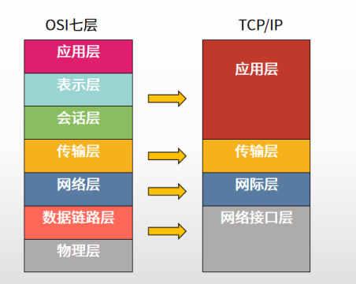
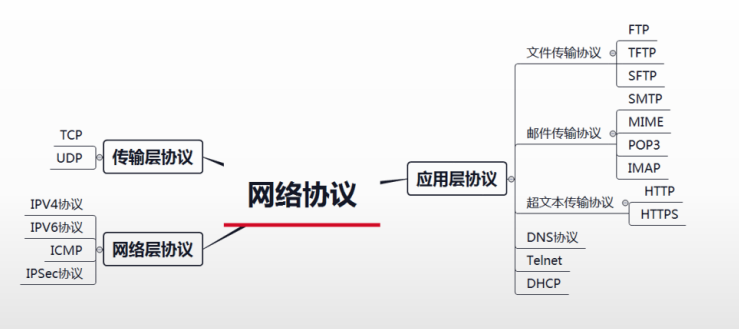
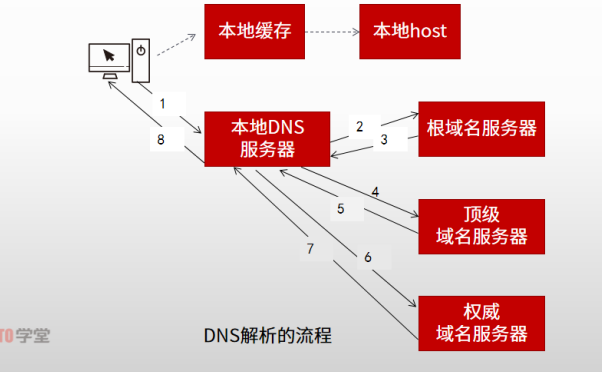
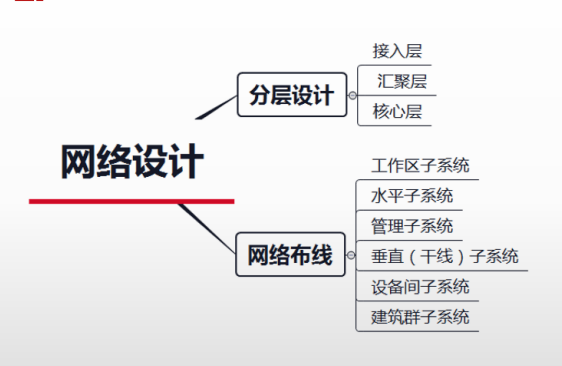
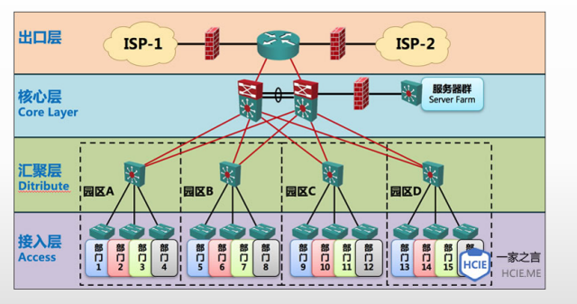
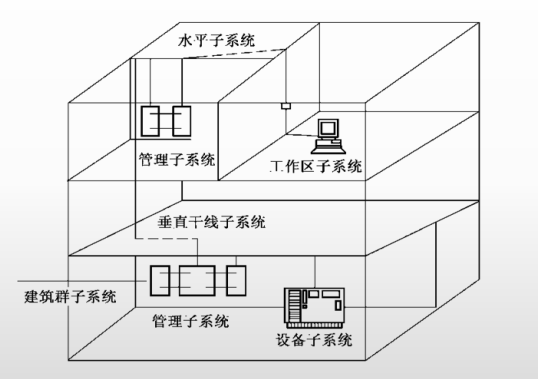

# 计算机网络

# 一、网络互联模型

> 1977年，国际标准化组织为适应网络标准化发展的需求，制定了开放系统互联参考模型(Open System Interconnection/,Reference Model,OSI/RM),从而形成了网络架构的国际标准。OSI/RM构造了由下到上的七层模型，分别是物理层、数据链路层、网络层、传输层、会话层、表示层和应用层。
>
> 互联网协议(Internet Protocol Suite)是一个网络通信模型，以及一整个网络传输协议家族，为互联网的基础通信架构。它常被通称为TCPP协议族（英语：TCP/IP Protocol Suite,或TCP/IP Protocols),简称TCP/IP。因为该协议家族的两个核心协议：TCP(传输控制协议)和IP(网际协议)为该家族中最早通过的标准。

对应关系：

- OSI的应用层、表示层、会话层对应TCP/IP的应用层
- OSI的传输层对应TCP/IP的传输层
- OSI的网络层对应TCP/IP的网际层
- OSI的数据链路层与物理层对应TCP/IP的网络接口层

### 1.1 OSI七层模型功能

由上到下依次：

- 应用层：处理网络应用、直接为端用户服务，提供各类应用过程的接口和用户接口
- 表示层：数据表示、使应用层可以根据其服务解释数据的含义、通常包括编码的约定，本地句法的转换，例如：ASCII
- 会话层：互联主机通信、负责管理远程用户或进程间的通信，通常包括通信控制、检查点设置、重建中断的传输链路、名字查找和安全验证服务。例如：RPC、SQL等
- 传输层：端到端连接、实现发送端和接收端的端到端的数据分组传送，负责保证实现数据包无差错、按顺序、无丢失和无冗余的传输。其服务访问点为端口。代表性协议有TCP、UDP、SPX等
- 网络层：分组传输和路由选择、通过网络连接交换传输层实体发出的数据，解决路由器选择、网络拥塞、异构网络互联的问题。服务访问点为逻辑地址（网络地址）。代表性协议有IP、IPX等
- 数据链路层：传输以帧为单位的信息、建立、维持和释放网络实体之间的数据链路，把流量控制合并在一起。为MAC(媒介访问层)和LLC(逻辑链路层)两个子层。服务访问点为物理地址(MAC地址)。代表性协议有IEEE802.3/.2、HDLC、PPP、ATM等
- 物理层：二进制传输、通过一系列协议定义了通行设备的机械的、电气的、功能的、规程的特征。代表性协议有RS232、V.35、RJ-45、FDDI等

# 二、网络协议

常见网络协议：

## 2.1 文件传输协议

常见协议：

- FTP(文件传输协议)：是网络上两台计算机传送文件的协议，运行在TCP之上，是通过Internet将文件从一台计算机传输到另一台计算机的一种途径。FTP在客户机和服务器之间需建立两条TCP连接，一条用于传送控制信息（使用**21**号端口），另一条用于传送文件内容（使用20号端口）。
- TFTP(简单文件传输协议)：是用来在客户机与服务器之间进行简单文件传输的协议，提供不复杂、开销不大的文件传输服务。TFTP建立在UDP(User Datagram Protocol,用户数据报协议)之上，端口号**69**。它提供不可靠的数据流传输服务，不提供存取授权与认证机制，使用超时重传方式来保证数据的到达。
- SFTP(安全文件传送协议)：是基于SSH的文件传输协议，提供文件访问、传输和管理功能。会对信息加密，但效率相当更低

## 2.2 邮件传输协议

常见协议：

- SMTP(Simple Mail Transfer Protocol,简单邮件传输协议)用于发送邮件：用户代理向源服务器发送邮件以及源服务器向目的服务器发送邮件使用的协议。
- MlME(Multipurpose Internet Mail Extensions,多用途互联网袖邮件扩展类型)：MME消息能包含文本、图像、音频、视频等多媒体数据。多用于指定一些客户端自定义的文件名，以及一些媒体文件打开方式。而S/MME安全的多功能互联网邮件扩展与安全电子邮箱服务相关。
- 邮局协议POP3：用于从目的邮件服务器上读取邮件。POP3允许用户从服
  务器上把邮件存储到本地主机上，同时删除保存在邮件服务器上的邮件。
- IMAP(Internet Mail Access Protocol,交互式邮件存取协议)：与
  POP3类以。不同的是，在电子邮件客户端收取的邮件仍然保留在服务
  器上，同时在客户端上的操作都会反馈到服务器上，如：删除邮件，标
  记已读等，服务器上的邮件也会做相应的动作。

## 2.3 超文本传输协议

常见协议：

- HTTP(Hypertext TransferProtocol,.超文本传输协议)是用于从WWW服务器传输超文本到本地浏览器的传送协议。它可以使浏览器更加高效，使网络传输减少。HTTP建立在TCP之上，端口号**80**。
- HTTPS(Hypertext Transfer Protocol Secure)是以安全为目标的HTTP通道，在HTTP的基础上通过传输加密和身份认证保证了传输过程的安全性。HTTPS在HTTP的基础下加入SSL,HTTPS的安全基础是SSL,因此加密的详细内容就需要SSL。HTTPS使用的端口号是**443**。

## 2.4 DNS协议

- DNS协议：域名系统(Domain Name System,DNS)把主机域名解析为lP地址的系统。
- PTR(Pointer Recored)：负责将IP地址映射到域名的解析。

### 2.4.1 查询方法

- 迭代查询：查询得到的是其他服务器的**引用**，本地服务器就要访问被引用的服务器，做进一步查询，相当于踢皮球的查询，比如根域名服务器查不到， 就会踢给顶级域名服务器查，顶级查不到就去权威查
- 递归查询：查询方式要求服务器彻底的进行名字**解析**，并返回最后的结果。本地DNS服务器就是递归查询，所有查询都是自己去的。自己去根域名服务器，去顶级域名服务器

## 2.5 远程登录协议

Telnet远程登录协议。是Interneti远程登录服务的标准协议和主要方式。它为用户提供了在本地计算机上完成远程主机工作的能力。在终端使用者的电脑上使用telneti程序，用它连接到服务器。终端使用者可以在telneti程序中输入命令，这些命令会在服务器上运行，就像直接在服务器的控制台上输入一样。可以在本地就能控制服务器。要开始一个telnet会话，必须输入用户名和密码来登录服务器。Telnet协议使用
TCP协议，端口号**23**。
Telnet是一个明文传送协议，它将用户的所有内容，包括用户名和密码都明文在互联网传送，具有一定的**安全隐患**。

## 2.6 动态主机配置协议

DHCP(Dynamic Host Configuration Protocol,动态主机配置协议)：通常被应用在大型的局域网络环境中，主要作用是集中的管理、分配IP地址，使网络环境中的主机动态的获得P地址、网关地址、DNS服务器地址等信息，并能够提升地址的使用率。

存在**多个DNCP**服务器时：

- 各自负责不同的网段
- 负责相同网段的话，客户端只会根据**第一个**收到的OFFER报文，返回响应报文

## 2.7 TCP和UDP协议

传输层协议

- TCP：可靠的、面向连接的、字节流服务、首部开销20个字节
  - 具有差错校验和重传、流量控制、拥塞控制、适用于数据量比较少、对可靠性要求高德场合
- UDP：不可靠的、无连接、面向报文、首部开销8个字节
  - 数据量大、可靠性要求不是很高，但速度要求快的场合

## 2.8 IPV4协议

网络层协议

- IP(PV4)地址是一个32位的二进制数的逻辑地址，为了表示方便，将32位二进制数划分成4个字节，每个字节间以“”区分。例如，IP地址11000000101010001100100010000000，用十进制表示就是192.168.200.128
- IP地址由两个部分组成，网络号+主机号
- 网络号的位数决定了可以分配的网络数：2^n
- 主机号的位数决定了网络中的最大主机个数：2^m-2
  - 特殊的IP地址：网络地址：主机号全0表示网络地址，如192.168.0.0。
  - 广播地址：主机号全1表示广播地址，如192.168.0.255。
  - 子网掩码（网络号部分全为1，主机号部分全为0；用于计算网络地址使用)(只需将IP地址和子网掩码做与操作，就可以得到网络地址)

### 2.8.1 分类

- A类(1~126)：固定二进制0开头，一个字节做网络位
- B类(128~191)：固定10开头，两个字节做网络位
- C类(192~223)：固定110开头，三个字节做网络位
- D类(224~239)：固定1110开头 + 组播地址
- E类(240~255)：固定1110开头 + 保留地址
- 三级IP地址：网络号(三个字节) +子网号 + 主机号
- 子网掩码也是32位二进制数，**网络与子网表示均为1，主机标识均为0**
  - 例如：A类地址子网掩码位：255.0.0.0

真题中：192.168.192.0/20中的20为网络位的位数

## 2.9 IPV6协议

网络层协议

- IPv6(Intermet Protocol Version6)是用于替代现行lPv4的下一代IP协议。IPv6的地址长度为128位，但通常写作8组，每组为4个十六进制数，如2002：0db8:85a3:08d3:1319:8a2e:0370:7345是一个合法的PV6地址。

- IPv6的书写规则：

  - 任何一个16位段中起始的0不必写出来；任何一个16位段如果少于4个十六进制的数字，就认为忽略了起始部分的数字0。

    例如，2002：0db8:85a3:08d3:1319:8a2e:0370:7345的第2、第4和第7段包含起始0。使用简化规则，该地址可以书写为2002:db8:85a3:8d3:1319:8a2e:370:7345。注意：只有起始的0才能被忽略，末尾的0不能忽略。

  - 任何由全0组成的1个或多个16位段的单个连续字符串都可以用一个双冒号”："来表示。例如：2002：0：0：0：0：0：0001可以简化为2002：：1。注意：双冒号只能用一次。

IPv6目的地址

- 单播：一对一通信
- 多播/组播：一对多通信
- 任意播：新增类型，一对最近

IPv4到IPv6的过渡技术：

- 双协议栈技术：两种技术**共存**
- 隧道技术：在IPv4网络中部署**隧道**
- NAT-IP技术：NAT-AP网关中实现两种协议的转换**翻译**和地址的**映射**

## 2.10 ICMP协议

网络层协议

Internet控制报文协议(Internet Control Message Protocol,ICMP)是TCP/IP协议簇的一个子协议，是网络层协议，用于iP主机和路由器之间传递控制消息。控制消息是指网络通不通、主机是否可达、路由是否可用等网络本身的消息。这些控制消息虽然并不传输用户数据，但是对用户数据的传递起着重要的作用。
ICMP报文**封装在IP数据报内传输**，封装结构由IP首部 + ICMP报文组成。由于IP数据报首部校验和并不检验IP数据报的内容，因此不能保证经过传输的ICMP报文
不产生差错。

## 2.11 IPSec协议

IPSec协议(Internet Protocol Security,互联网安全协议)是一个协议包，通过对IP协议的分组进行加密和认证来保护IP协议的网络传输协议簇（一些相互关联的协议的集合）

IPSec可以实现以下4项功能：

-  数据机密性：IPSec发送方将包加密后再通过网络发送。
- 数据完整性：IPSec可以验证IPSec发送方发送的包，以确保数据传输时没有被改变。
- 数据认证：IPSec接受方能够鉴别IPsect包的发送起源。此服务依赖数据的完整性。
- 反重放：IPSec接受方能检查并拒绝重放包。

IPSec主要由以下协议组成：

- 认证头(AH),为IP数据报提供无连接数据完整性、消息认证以及防重放攻击保护；
- 封装安全载荷(ESP),提供机密性、数据源认证、无连接完整性、防重放和有限的传输流(traffic-flow)机密性；
- 安全关联(SA),提供算法和数据包，提供AH、ESP操作所需的参数。
- 密钥协议(KE)，,提供对称密码的钥匙的生存和交换。

# 三、网络设计

### 3.1 分层设计

- 接入层。通常将网络中**直接面向用户连接或访问网络**的部分称为接入层，目的是允许终端用户连接到网络，主要解决相邻用户之间的互访需求，并且为这些访问提供足够的带宽，接入层还应当适当负责一些**用户管理功能**（如地址认证、用户认证、计费管理等），以及**用户信息收集工作**(如用户的P地址、MAC地址、访问日志等)。
- 汇聚层。是核心层和接入层的分界面，完成**网络访问策略控制、数据包处理、过滤、寻址**，以及其他数据处理的任务。汇聚层交换机是多台接入层交换机汇聚点，它必须能够处理来自接入层设备的所有通信量，并提供到核心层的上行链路，因此，汇聚层交换机与接入层交换机比较，需要更高的性能、更少的接口和更高的交换速率。
- 核心层。网络主干部分称为核心层，核心层的主要目的在于通过**高速转发通信**，提供优化、可靠的骨干传输结构，因此，核心层交换机应拥有更高的可靠性，性能和吞吐量。核心层为网络提供了骨干组件或高速交换组件，在纯粹的分层设计中，核心层只完成数据交换的特殊任务。核心层的设备采用**双机冗余热备份**是非常必要的，也可以使用负载均衡功能来改善网络性能。

### 3.2 综合布线系统

综合布线系统是一个用于传输语音、数据、影像和其他信息的标准结构化布线系统，是建筑物或建筑群的传输网络，它使语言和数据通信设备、交换设备和其他信息管理系统彼此相连接。

综合布线系统结构有6个独立的子系统：

- 工作区子系统：它是工作区内**终端设备连接到信息插座**之间的设备组成，包括插线板、信息插座、连接软线、适配器、计算机、网络集散器、电话、报警探头、摄像机、监视器、音响等。
- 水平子系统：水平子系统是布置在同一楼层上，一端接在信息插座，另一端接在配线间的跳线架上，它的功能是将干线子系统线路延伸到用户工作区，将用户工作区引至管理子系统，并为用户提供一个符合国际标准，满足语音及高速数据传输要求的信息点出口。
- 管理子系统：安装有线路管理器件及各种公用设备，实现整个系统集中管理，它是干线子系统和水平子系统的桥梁，同时又可为同层组网提供条件。其中包括双绞线跳线架、跳线（有快接式跳线和简易跳线之分）。
- 垂直（干线）子系统：通常它是由**主设备间至各层管理间**，特别是在位于中央点的公共系统设备处提供多个线路设施，采用大对数的电缆馈线或光缆，两端分别端接在设备间和管理间的跳线架上，目的是实现计算机设备、程控交换机(PBX)、控制中心与各管理子系统间的连接，是建筑物干线电缆的路由。
- 设备间子系统：该子系统是由设备间中的电缆、连接跳线架及相关支撑硬件、防雷电保护装置等构成。可以说是整个配线系统的中心单元，因此它的布放、造型及环境条件的考虑适当与否，直接影响到将来信息系统的正常运行及维护和使用的灵活性。电话交换机、计算机主机设备及入口设施也可与配线设备安装在一起。
- 建筑群子系统：它是将**多个建筑物**的数据通信信号连接成一体的布线系统，它采用架空或地下电缆管道或直埋敷设的室外电缆和光缆互连起来，是结构化布线系统的一部分，支持提供楼群之间通信所需的硬件。

